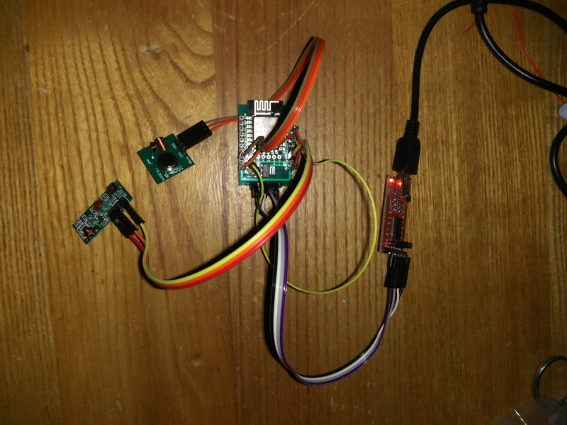
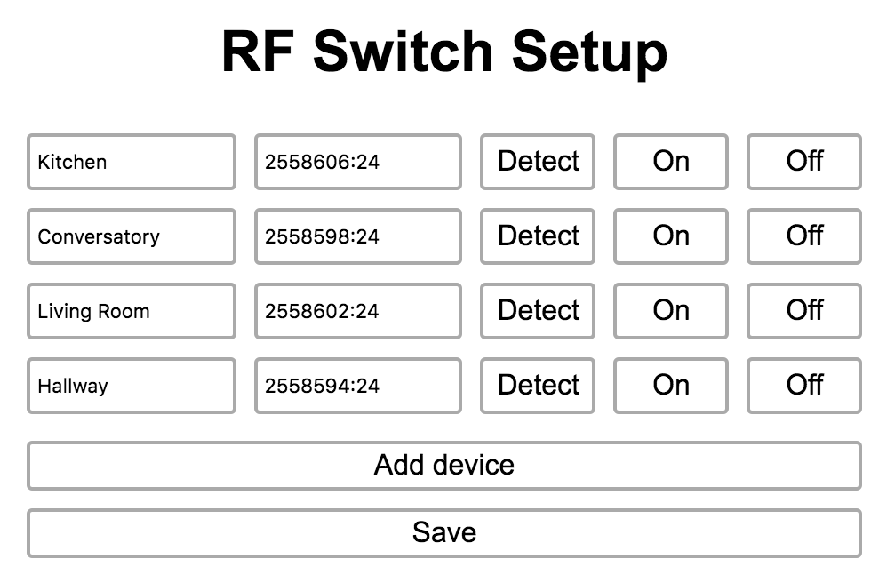

ESP RF Switch
=============

Control your remote Energenie devices (and other 433Mhz modules) with the ESP8266. Designed to used the my Zetta IoT hub project but will work standalone as well.

Hardware
--------

Prequisties
-----------

- An ESP8266 module (tested using the ESP-12E)
- 433Mhz RF modules (needs Tx but Rx is optional for sniffing codes)
- The free Arduino IDE. You need to have ESP8266 libraries installed within the Arduino IDE.
- USB Serial interface for flashing firmware

Installation
------------

- Open `esp-rf-switch` with the Arduino IDE
- Short pin 0 to GND
- Attached Tx data to pin 4 and Rx data to pin 5 (these can be changed)

Configuration
-------------

- Disconnect pin 0
- Turn on ESP, it will create a hotspot for WiFi configuration
- Connect to SSID `ESPRFSwitchXXXXXX`
- Open browser to `192.168.1.4`. Follow instructions

ESP should now be on the network. You will need to discover its IP address by looking at yours router's DHCP table and scanning for it.

- Open browser to your `http:\\{ESPIP\setup`
- Add your device names and use `Listen` button to detect the code from your energenie remote
- Test that your devices work with the `On` / `Off` buttons
- Save the configuration

ESP is now configured. If you are running the Zetta ESP scout, it will automatically be detected used by Zetta.
